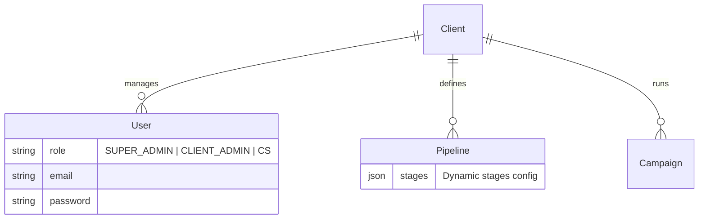

# 🚀 Asoy Analytics Ads

> Universal Ad-Tracker & Dynamic CRM Platform

[](https://nextjs.org/)
[](https://www.typescriptlang.org/)
[](https://www.postgresql.org/)
[](https://www.prisma.io/)
[](https://tailwindcss.com/)
[](https://ui.shadcn.com/)

---

## 📋 Overview

**Asoy Analytics Ads** (sebelumnya AAA Ads CRM) adalah platform Business Intelligence & CRM multi-tenant yang dirancang untuk memonitor efektivitas iklan (Ad Spend) terhadap hasil bisnis nyata (Revenue/Leads).

### Core Features (Implemented)

- 🏢 **Multi-Tenant Architecture**: Satu aplikasi melayani banyak klien dengan isolasi data.
- 🔐 **Robust Authentication**: Sistem login aman menggunakan NextAuth.js v5 dengan Google OAuth & Credentials, serta Role-Based Access Control (Super Admin, Client Admin, CS).
- 🎨 **Modern UI/UX**: Desain Glassmorphism yang bersih dengan dukungan **Dark/Light Mode** penuh.
- 👥 **User Management**: Manajemen pengguna terpusat dengan role yang fleksibel.
- 📊 **Interactive Analytics**: Dashboard performa iklan dengan filter multi-platform (Meta, Google, TikTok) dan fitur export laporan.
- 📱 **Responsive Design**: Tampilan optimal di desktop dan mobile.

### Upcoming Features

- 📥 **Smart CSV Import**: Upload & mapping data iklan dari berbagai platform (Meta, Google, TikTok).
- 📊 **Excel-Like Grid**: Edit data inline seperti spreadsheet.
- 🔄 **Dynamic Pipeline**: Custom alur bisnis per klien.
- 📈 **Real-Time Analytics**: CPPL, ROAS, dan metrik kustom.

---

## 🛠 Tech Stack

| Layer | Technology | Status |
|-------|------------|--------|
| **Framework** | Next.js 14+ (App Router) | ✅ Active |
| **Language** | TypeScript (Strict Mode) | ✅ Active |
| **Database** | Supabase (PostgreSQL 16) | ✅ Active |
| **ORM** | Prisma | ✅ Active |
| **Styling** | Tailwind CSS v4 | ✅ Active |
| **Components** | Shadcn/UI | ✅ Active |
| **Theming** | next-themes (Light/Dark) | ✅ Active |
| **Auth** | NextAuth.js v5 (Auth.js) | ✅ Active |
| **Icons** | Lucide React | ✅ Active |

---

## 🚀 Getting Started

### Prerequisites

- Node.js 18+
- Git
- Supabase Account (or local PostgreSQL)

### Installation

```bash
# Clone repository
git clone https://github.com/dena-pratama/AAA-ads-T-dyn-CRM.git
cd AAA-ads-T-dyn-CRM

# Install dependencies
npm install

# Setup Environment Variables
cp .env.example .env
# (Isi DATABASE_URL, NEXTAUTH_SECRET, GOOGLE_CLIENT_ID, dll)

# Setup database
npx prisma generate
npx prisma migrate dev

# Start development server
npm run dev
```

Open [http://localhost:3000](http://localhost:3000)

---

## 📁 Project Structure

```
├── src/
│   ├── app/                    # Next.js App Router
│   │   ├── (auth)/             # Auth routes (Login)
│   │   ├── (dashboard)/        # Main app routes
│   │   ├── api/                # Backend API routes
│   │   ├── actions/            # Server Actions
│   │   └── layout.tsx          # Root layout with ThemeProvider
│   ├── components/             # React components
│   │   ├── ui/                 # Reusable Shadcn components
│   │   ├── layout/             # Layout components (Header, Sidebar)
│   │   └── mode-toggle.tsx     # Theme switcher
│   ├── lib/                    # Utilities & Config (Prisma, Auth)
│   └── hooks/                  # Custom React Hooks
├── prisma/
│   └── schema.prisma           # Database schema definition
├── public/                     # Static assets (Logos)
└── package.json
```

---

## 📊 Database Schema Highlights



---

## 📝 Documentation

- [TASKS.md](./TASKS.md) - Rincian tugas pengembangan
- [CHANGELOG.md](./CHANGELOG.md) - Riwayat perubahan versi

---

## 👥 Team

- **Project Owner:** Dena Pratama
- **Development:** AI-Assisted (Antigravity Agent)
