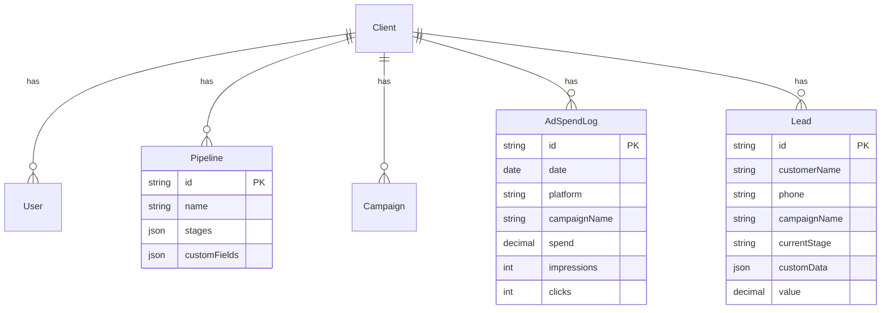

# 🚀 AAA Ads CRM

> Universal Ad-Tracker & Dynamic CRM Platform

[](https://nextjs.org/)
[](https://www.typescriptlang.org/)
[](https://www.postgresql.org/)
[](https://www.prisma.io/)

---

## 📋 Overview

**AAA Ads CRM** adalah platform Business Intelligence & CRM multi-tenant untuk memonitor efektivitas iklan (Ad Spend) terhadap hasil bisnis nyata (Revenue/Leads).

### Core Features

- 🏢 **Multi-Tenant**: Satu aplikasi untuk banyak klien
- 📥 **Smart CSV Import**: Upload & mapping data iklan dari berbagai platform
- 📊 **Excel-Like Grid**: Edit data inline seperti spreadsheet
- 🔄 **Dynamic Pipeline**: Custom alur bisnis per klien
- 📈 **Real-Time Analytics**: CPPL, ROAS, dan metrik kustom

---

## 🛠 Tech Stack

| Layer | Technology |
|-------|------------|
| Framework | Next.js 14+ (App Router) |
| Language | TypeScript (Strict) |
| Database | PostgreSQL 16 |
| ORM | Prisma |
| UI | Shadcn/UI + Tailwind CSS |
| Data Grid | TanStack Table |
| File Parsing | SheetJS (xlsx) |
| Auth | NextAuth.js v5 |
| Deployment | Docker |

---

## 🚀 Getting Started

### Prerequisites

- Node.js 18+
- Docker & Docker Compose
- Git

### Installation

```bash
# Clone repository
git clone https://github.com/dena-pratama/AAA-ads-T-dyn-CRM.git
cd AAA-ads-T-dyn-CRM

# Install dependencies
npm install

# Start database
docker-compose up -d

# Setup database
npx prisma migrate dev
npx prisma db seed

# Start development server
npm run dev
```

Open [http://localhost:3000](http://localhost:3000)

---

## 📁 Project Structure

```
├── src/
│   ├── app/                    # Next.js App Router
│   │   ├── (auth)/             # Auth routes
│   │   ├── (dashboard)/        # Protected routes
│   │   └── api/                # API routes
│   ├── components/             # React components
│   │   ├── ui/                 # Shadcn components
│   │   └── data-table/         # Table components
│   ├── lib/                    # Utilities
│   └── hooks/                  # Custom hooks
├── prisma/
│   └── schema.prisma           # Database schema
├── docker-compose.yml
└── package.json
```

---

## 📊 Database Schema



---

## 🔐 Authentication

### Roles

| Role | Access |
|------|--------|
| SuperAdmin | Full system access |
| ClientAdmin | Client-scoped access |
| CS | Lead entry only |

---

## 📝 Documentation

- [TASKS.md](./TASKS.md) - Detailed development tasks
- [CHANGELOG.md](./CHANGELOG.md) - Development history

---

## 📄 License

Private - All Rights Reserved

---

## 👥 Team

- **Project Owner:** Dena Pratama
- **Development:** AI-Assisted (AAA Ads CRM)
